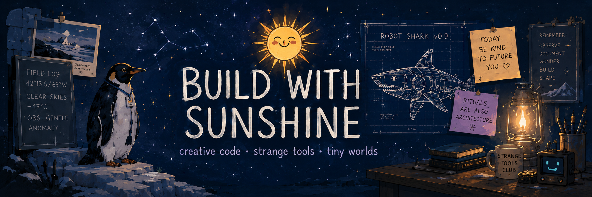

  

<h1 align="center">Sara | Build with Sunshine ☀️</h1>

  <b>Creative technologist building calm tools, weird little systems, and projects that probably should not exist</b>

  Code as workshop. Projects as worlds. Learning as field research.

---

## ✦ Current Lab Status

<table>
  <tr>
    <td><b>Learning</b></td>
    <td>Python · JavaScript · interaction design · robotics foundations</td>
  </tr>
  <tr>
    <td><b>Building</b></td>
    <td>calm learning tools · creative coding experiments · tiny digital worlds</td>
  </tr>
  <tr>
    <td><b>Exploring</b></td>
    <td>language, memory, interface emotion, playful systems</td>
  </tr>
  <tr>
    <td><b>Mood</b></td>
    <td>structured chaos, but with better lighting</td>
  </tr>
</table>

---

## ✦ Languages & Tools

  
  
  
  
  
  
  
  

---

## ✦ Currently Building

<table>
  <tr>
    <td width="50%">
      <h3>🐧 Penguin</h3>
      
A soft winter-themed Russian learning experience focused on atmosphere, speech, and calm interaction.

      
<i>Private for now. Still forming. Still teaching me things.</i>

    </td>
    <td width="50%">
      <h3>🦈 Robot Shark Companion</h3>
      
A local AI desk companion concept with memory, personality, and eventually a body.

      
<i>Equal parts practical assistant and tiny menace.</i>

    </td>
  </tr>
</table>

---

## ✦ Public Project Shelf

<table>
  <tr>
    <td width="50%">
      <h3>🏛 Museum of Broken Ideas</h3>
      
A small digital museum for beautiful, failed, strange, unfinished, or absurd ideas.

      
<i>Status:</i>in progress / public / front-end practice

    </td>
    <td width="50%">
      <h3>🪄 Glitch Poetry Generator</h3>
      
A creative coding experiment where text fractures, mutates, and becomes strange on purpose.

      
<i>Status:</i> planned public build / pratice project

    </td>
  </tr>
</table>

---

## ✦ Field Notes

- I like software that feels intentional instead of loud.
- I’m interested in learning tools that reduce pressure instead of adding noise.
- I build slowly, notice too much, and make things that probably should not exist.
- I care about atmosphere, interaction, and the small details that make a system feel alive.

---

  <i>We do not just write code. We leave little signals for future selves.</i>

